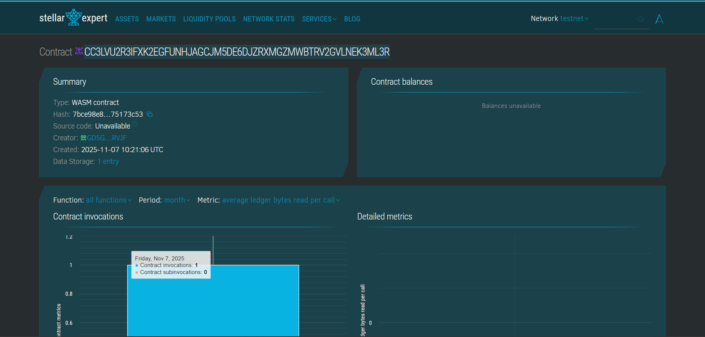

## Basic Token Creator
Project Description
Develop a simple interface for creating custom tokens (assets) on Stellar with basic configuration options. This smart contract provides an easy-to-use platform for users to create and manage their own tokens on the Stellar blockchain using Soroban smart contracts. The contract allows token creators to define essential parameters such as token name, symbol, and total supply, making token creation accessible to everyone.

## Project Vision
Our vision is to democratize token creation on the Stellar network by providing a straightforward, secure, and efficient smart contract solution. We aim to empower developers, entrepreneurs, and blockchain enthusiasts to launch their own digital assets without requiring deep technical knowledge of blockchain infrastructure. By simplifying the token creation process, we want to foster innovation and growth in the Stellar ecosystem, enabling new use cases for decentralized applications, digital currencies, and tokenized assets.
## Key Features
1. Simple Token Creation
Create custom tokens with just a few parameters: name, symbol, and total supply
Automatic unique token ID generation for each created token
Timestamp recording for creation tracking
Creator address authentication and storage
2. Token Information Retrieval
Query token details using unique token ID
Access complete token metadata including creator, supply, and creation time
User-friendly default responses for non-existent tokens
3. Total Token Tracking
Global counter tracking the total number of tokens created on the platform
Transparent visibility into platform usage and adoption
4. Supply Management
Token creators can update the total supply of their tokens
Secure authorization ensuring only the original creator can modify supply
Flexible supply adjustment for evolving project needs
5. Security Features
Address-based authentication using require_auth()
Input validation to prevent invalid token parameters
Secure storage with extended TTL (Time-To-Live) for data persistence
6. Storage Efficiency
Optimized data structures using Soroban's native types
Instance storage for efficient data retrieval
Extended storage TTL of 5000 ledgers for long-term persistence

## Future Scope
Short-term Enhancements
Token Transfer Functionality
Implement peer-to-peer token transfers
Add balance tracking for token holders
Support for multi-address distributions
Metadata Expansion
Add token description and logo URL fields
Include project website and social media links
Support for token categories/tags
Access Control Improvements
Implement role-based permissions (admin, minter, burner)
Add multi-signature support for critical operations
Enable delegated authority management
Mid-term Development
Advanced Supply Management
Implement token burning functionality
Add minting capabilities for controlled supply increase
Support for supply caps and circulation limits
Token Standards Compliance
Full compatibility with Stellar Asset Contract (SAC) standard
Integration with Stellar DEX for immediate liquidity
Support for atomic swaps and cross-chain bridges
Analytics Dashboard
Transaction history tracking
Holder distribution statistics
Supply change audit logs
## Long-term Vision
DeFi Integration
Liquidity pool creation for token pairs
Staking and yield farming capabilities
Integration with lending/borrowing protocols
Governance Features
Token-based voting mechanisms
Proposal creation and execution
Community-driven development decisions
Enterprise Features
Batch token creation for multiple assets
Automated compliance and regulatory reporting
Integration with traditional financial systems
Cross-Chain Compatibility
Bridge contracts for asset migration
Support for wrapped tokens from other blockchains
Interoperability with major blockchain networks
Technical Specifications
Blockchain: Stellar (Soroban Smart Contracts)
Language: Rust
SDK: soroban-sdk
Storage: Instance Storage with 5000 ledger TTL
Authentication: Address-based with require_auth()

Getting Started
Prerequisites
Rust toolchain installed
Soroban CLI installed
Stellar account for deployment
Installation
bash
# Clone the repository
git clone <repository-url>

# Build the contract
soroban contract build

# Deploy to testnet
soroban contract deploy \
  --wasm target/wasm32-unknown-unknown/release/basic_token_creator.wasm \
  --source <your-account> \
  --network testnet
Usage Example
bash
# Create a new token
soroban contract invoke \
  --id <contract-id> \
  --source <creator-account> \
  --network testnet \
  -- create_token \
  --creator <creator-address> \
  --name "My Token" \
  --symbol "MTK" \
  --total_supply 1000000

# Get token information
soroban contract invoke \
  --id <contract-id> \
  --network testnet \
  -- get_token_info \
  --token_id 1
Contributing
We welcome contributions from the community! Please feel free to submit pull requests, report issues, or suggest new features.

License
This project is open source and available under the MIT License.

Contact
For questions, support, or partnership opportunities, please reach out to our team.
## CONTRACT DETAILS
 CONTRACT ID:CC3LVU2R3IFXK2EGFUNHJAGCJM5DE6DJZRXMGZMWBTRV2GVLNEK3ML3R
